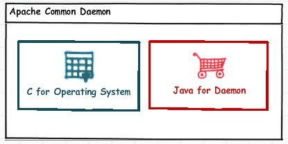

# apache  Commons Daemon (後台運行)

http://commons.apache.org/proper/commons-daemon/index.html

> ## info
> 1. Java程序在後台長期運行時的一些需求與困難。
> 2. Apache Common Daemon項目即是為解決這些情況，保證Java程序在後台長期運行而產生的。
> 3. 它源自Tomcat 4.0項目。
> 4. Apache Common Daemon分為兩個部分：一部分是用C寫的，與操作系統交互；另一部分是用Java寫的，提供Daemon接口。

> ##Both Win32 and UNIX like platforms are supported. 
> 1. For Win32 platforms use **procrun**. 
> 2. For UNIX like platforms use **jsvc**.

## Procrun

The Windows archive (e.g. commons-daemon-1.0.15-bin-windows.zip) contains 2 different executables:

* prunsrv.exe - service application for running applications as services.
* prunmgr.exe - the GUI manager application used to monitor and configure installed services.

There is only one prunmgr.exe application for all architectures. The prunsrv.exe executable is available in 3 different versions for different architectures. The version in the top-level directory is for 32-bit (x86) architectures. The lower level directories are for 64-bit systems:

* amd64 - AMD/EMT 64-bit
* ia64 - Intel Itanium 64-bit

The Windows application prunsrv.exe is used to install an application as a service. Once installed, prunmgr.exe can be used to monitor and reconfigure the service. (see procrun for more information). The Windows binary zip archive should be unpacked into the location from which you wish to run it, for example: %ProgramFiles%\Apache Commons Daemon

## jsvc

todo

