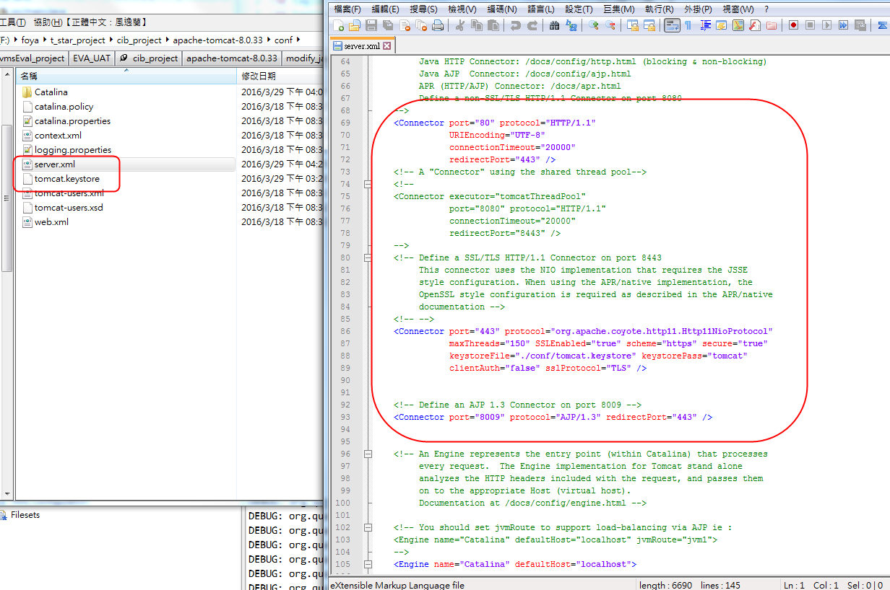

# keystore

```
create

keytool -genkeypair  -keystore e:/tmp/tomcat.keystore -dname "CN=tomcat, OU=tomcat, O=tomcat, L=tomcat, ST=tomcat, C=TW" -keypass tomcat -storepass tomcat -keyalg RSA -keysize 2048 -alias default -validity 99999
```


